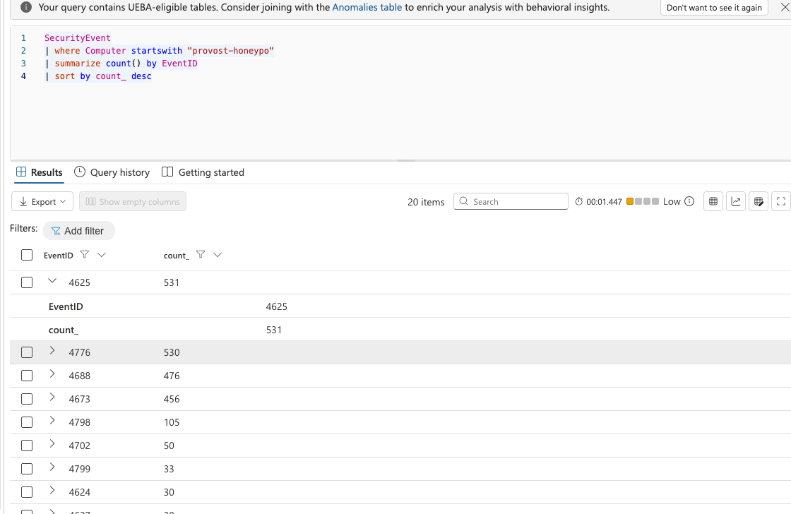
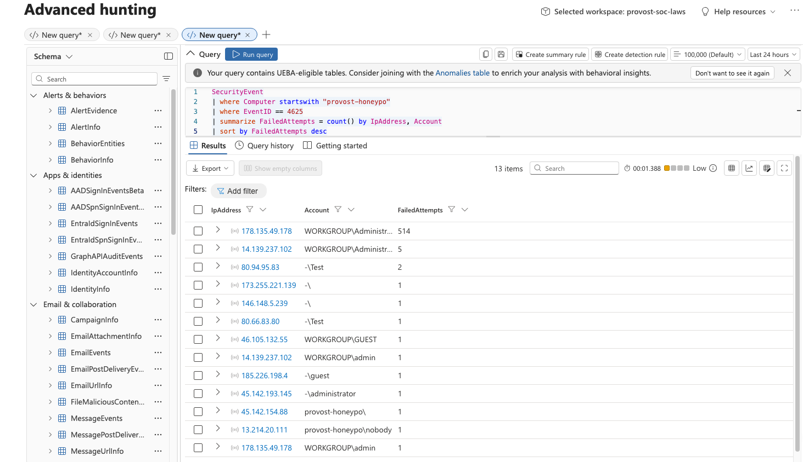
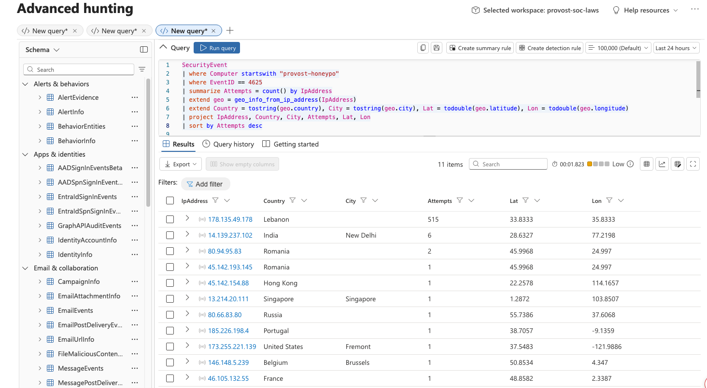
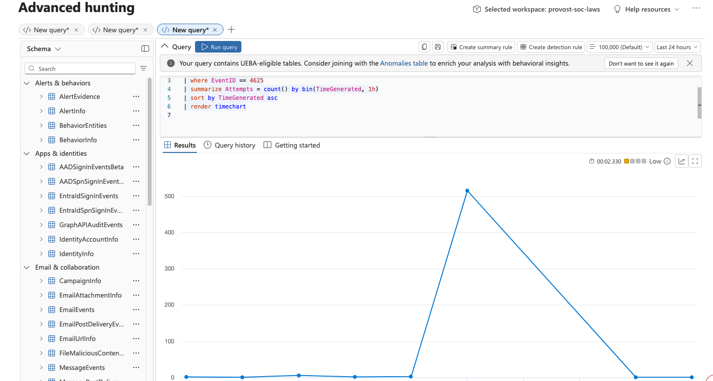
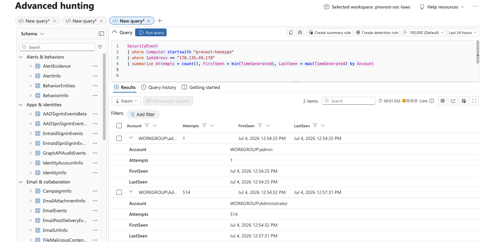
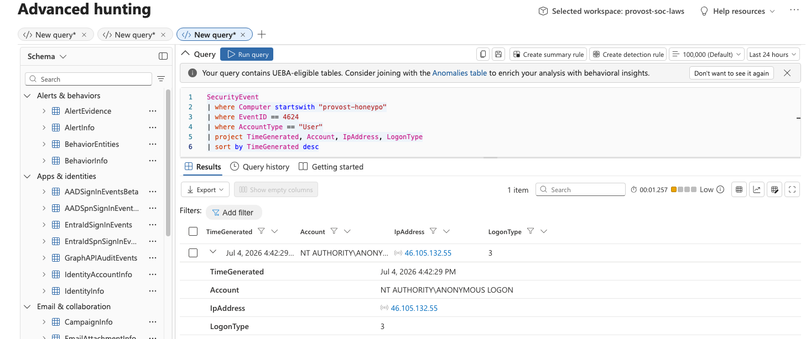

**Classification:** Informational / Threat Intelligence (controlled exposure)
**Date of activity:** July 4, 2026
**Environment:** Provost Inc SOC Lab isolated honeypot subnet
**Status:** Closed - no compromise

---

## Introduction

This report documents a controlled honeypot exercise in which an intentionally
exposed Windows virtual machine was placed on the public internet to collect and
analyze real-world attack traffic. The objective was to observe live attacker
behavior, validate the SOC's detection pipeline against genuine threats, and
practice incident triage on real data rather than simulations.

**Key finding:** Within approximately 5 hours of exposure, the honeypot was
discovered and attacked. Within 11 hours it was subjected to a sustained
automated brute-force of 515 attempts against the Administrator account. In
total, 531 malicious authentication attempts arrived from 9 countries across 4
continents. **No attacker successfully authenticated; the host was not
compromised.**

---

## Business Scenario

Organizations routinely underestimate how quickly an exposed system is attacked.
This exercise quantifies that risk with real data, demonstrating why internet-facing
assets must be hardened *before* exposure, not after. The honeypot was deployed in
a fully isolated network segment with no connectivity to any production or lab
resource, ensuring that a compromise of the decoy could not pivot to anything of
value.

---

## Objectives

- Deploy an internet-exposed VM safely, in complete network isolation
- Collect live attack telemetry into Microsoft Sentinel
- Analyze attacker sources, methods, targets, and timing
- Triage for compromise (did anyone actually get in?)
- Document the incident to professional SOC standards

---

## Technologies Used

- **Microsoft Azure** : isolated resource group, VNet, subnet, NSG
- **Windows Server VM** : the honeypot / sensor
- **Azure Monitor Agent + Data Collection Rule** : log forwarding
- **Log Analytics Workspace** : centralized telemetry
- **Microsoft Sentinel / Advanced Hunting** :analysis via KQL
- **KQL geo_info_from_ip_address()** : IP geolocation enrichment

---

## Architecture & Isolation Design

The honeypot was deliberately isolated from all other resources:

- **Dedicated resource group** (`provost-honeypot-rg`) : separate from the lab RG
- **Dedicated VNet** (`10.10.0.0/16`) : a non-overlapping address space with
  **no peering** to any lab network, so no route exists from the honeypot to real
  resources
- **Dedicated NSG** : the only ingress control, deliberately set to allow all
  inbound to attract traffic
- **Unique credentials** : used nowhere else, so a compromise could not enable
  credential reuse
- **Shared only one thing with the SOC:** the Sentinel workspace, for log
  collection

This isolation is the core safety principle: the decoy is designed to be
attacked, so it must be unable to reach anything that matters.

---

## Attack Analysis

### Volume

The honeypot recorded **531 failed logon events (Event ID 4625)** during the
observation window.

Supporting event IDs (4776 credential validation, 4688 process creation, 4673
privileged service calls) corroborated the brute-force pattern.

### Attacker Sources

Attacks originated from **13 distinct source IPs**, with one dramatically
dominant aggressor.

A single IP (`178.135.49.178`) accounted for 514 of the attempts against the
`Administrator` account, while a dozen other IPs made 1–6 opportunistic probes
each against common accounts (`admin`, `guest`, `test`, and null sessions).

### Geographic Distribution

Enriching the source IPs with geolocation revealed attacks from **9 countries
across 4 continents**.

| Country | Attempts |
|---------|----------|
| Lebanon | 515 |
| India | 6 |
| Romania | 3 |
| Hong Kong | 1 |
| Singapore | 1 |
| Russia | 1 |
| Portugal | 1 |
| United States | 1 |
| Belgium | 1 |
| France | 1 |

Notably, while attacks were *geographically broad*, ~97% of the volume came from
a single Lebanese IP — a distinction between distributed opportunistic scanning
and one determined, automated aggressor.

### Timeline

The attack volume was concentrated in a sharp burst rather than a steady stream.

| Event | Time (Jul 4, 2026) |
|-------|--------------------|
| VM exposed to internet | ~02:00 AM |
| First attack detected | 07:13:17 AM (~5 hrs after exposure) |
| Major brute-force burst | 12:54–12:57 PM (~11 hrs after exposure) |

### Lead Attacker Deep-Dive

The dominant attacker's profile reveals the speed of automated attacks:

- **Source:** `178.135.49.178` (Lebanon)
- **Target:** `WORKGROUP\Administrator`
- **Volume:** 514 attempts
- **Window:** 12:54:32 PM → 12:57:31 PM — **under 3 minutes**
- **Rate:** ~3 attempts per second (unmistakably automated tooling)
- Preceded by a single reconnaissance probe against the `admin` account

---

## Triage: Was the Host Compromised?

Critical check - did any attacker successfully authenticate?

The only successful user logon was `NT AUTHORITY\ANONYMOUS LOGON` (LogonType 3)
from `46.105.132.55` (France). **This is not a credentialed compromise** — it is
an anonymous network session, consistent with reconnaissance / enumeration
rather than password theft.

**Conclusion: no attacker authenticated with valid credentials. The host was not
compromised despite 531 attempts.**

---

## Validation

- ✓ Honeypot exposed in isolated network (no peering to lab/production)
- ✓ Logs flowing to Sentinel (confirmed via SecurityEvent)
- ✓ 531 attacks captured and analyzed
- ✓ 13 source IPs identified and geolocated
- ✓ Attack timeline established
- ✓ Compromise triage completed — no credentialed breach
- ✓ Host torn down after data collection

---

## Lessons Learned

- **Exposure is discovered fast.** ~5 hours from exposure to first attack; ~11
  hours to a sustained brute-force. Internet-facing assets are found and attacked
  as a matter of routine, not chance.
- **Attacks are automated and relentless.** 514 attempts in under 3 minutes is
  machine speed. Human-scale assumptions about attack pacing are wrong.
- **Default accounts are the first target.** `Administrator`, `admin`, `guest`,
  `test` — attackers assume these exist. Renaming/disabling defaults and
  enforcing strong unique credentials is the front-line defense.
- **Anonymous logon is a recon signal.** Restricting anonymous enumeration (via
  Group Policy) removes a reconnaissance avenue attackers rely on.
- **Isolation makes the exercise safe.** Because the decoy could reach nothing of
  value, the exposure carried no real risk.

---

## Enterprise Best Practices (how defenders prevent this)

- Never expose RDP directly to the internet; use a bastion host, VPN, or Just-in-Time VM access
- Restrict management ports at the NSG to known admin IPs (as done on the *hardened* lab VM)
- Enforce MFA and account lockout policies
- Disable/rename default administrative accounts
- Restrict anonymous enumeration via Group Policy
- Monitor for 4625 spikes with SIEM analytics rules and automated response

---

## Conclusion

This exercise turned an abstract security principle - "exposed systems get
attacked quickly" - into measured, documented reality. It demonstrated safe
honeypot design, live telemetry collection, real attacker analysis across
volume, source, geography, and timing, and professional compromise triage. The
data provides a concrete, defensible answer to *why* enterprises invest in
network hardening and identity controls: because the internet begins attacking
an exposed asset within hours, automatically, from everywhere.
